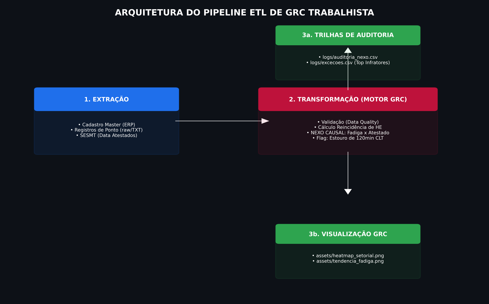
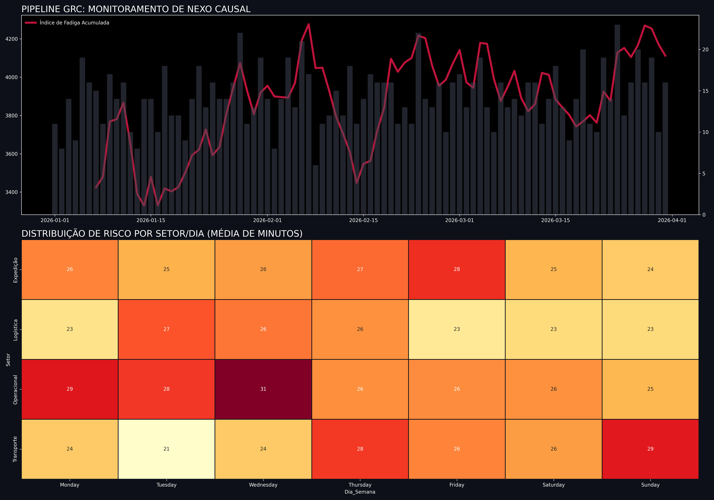

# 🛡️ Labor Risk Shield: Pipeline de Auditoria e GRC (NR-1)

Este projeto implementa um **Pipeline de Dados (ETL)** robusto para o monitoramento contínuo de riscos ocupacionais e conformidade trabalhista (Compliance). O motor de dados transforma registros brutos de jornada em inteligência preditiva para o SESMT e Departamento Pessoal.

## ⚙️ Arquitetura do Pipeline de Dados
Abaixo, o fluxo de engenharia que sustenta a auditoria, desde a extração dos dados brutos até a geração de trilhas de auditoria:

### Diferenciais Técnicos:
* **Data Quality:** Camada de validação de integridade dos registros de ponto.
* **Compliance Engine:** Cálculo automático de reincidência e estouro do limite de 120min de HE.
* **Nexo Causal:** Algoritmo que correlaciona fadiga acumulada com a probabilidade de absenteísmo.

## 📊 Dashboard de Monitoramento Recorrente
Resultado do processamento dos dados, identificando visualmente os setores e períodos onde a fadiga operacional gera passivos financeiros e médicos.

---
### 🔍 Governança e Rastreabilidade
O sistema gera automaticamente relatórios de exceção na pasta `/logs`, permitindo que o gestor de DP atue de forma cirúrgica nos focos de risco antes que se tornem processos trabalhistas.

**Igor Hilario Silva** | *Personnel Analyst & GRC Architect*
